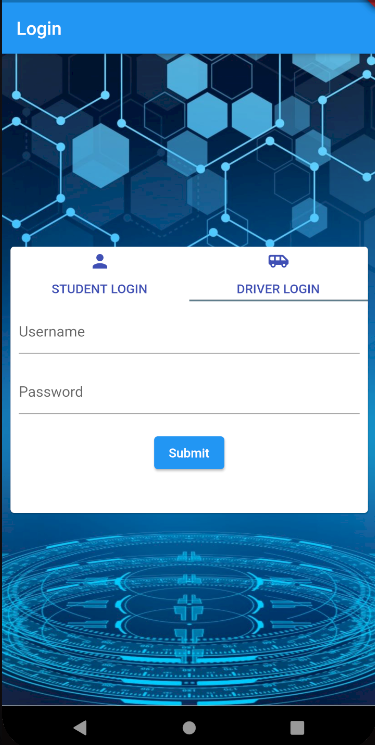
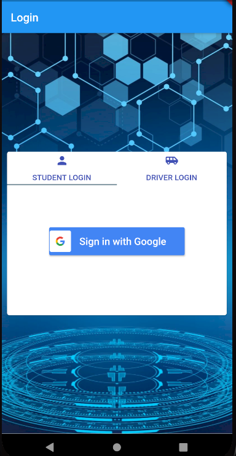
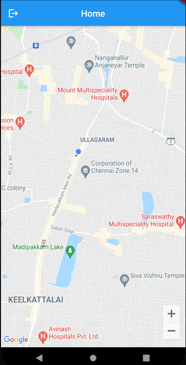
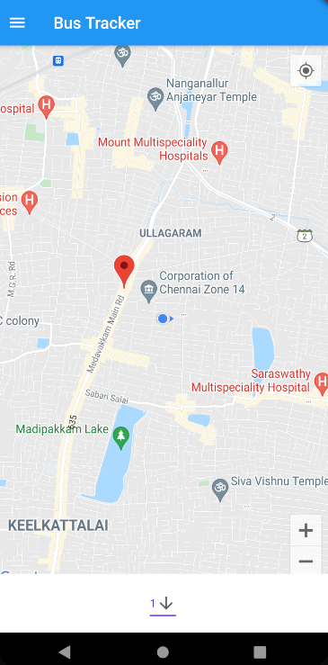

# Real Time Bus Tracker

An app aimed at providing real time bus information to users. This app was mainly buit with universities and schools in mind.

# The login pages

The app is divided into two login pages. The first page is for students and the second page is for drivers.

student login page only permits google sign in as it is easier this way for schools and colleges to restrict the usage only to their students.

# Driver home page

The driver home page shows the live location of the driver and transmits the GPS location to firebase firestore database.

# Student home page

The student home page shows the live location of the driver. This was made possible by adding a listener that constantly listens for changes in the driver's location in the firebase firestore database.

> Google cloud services was used to render the map. However, [flutter_map](https://pub.dev/packages/flutter_map) can also be used to render a static map with the same functionalities.
